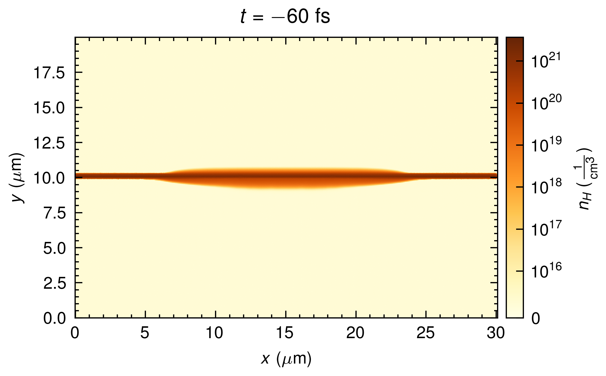
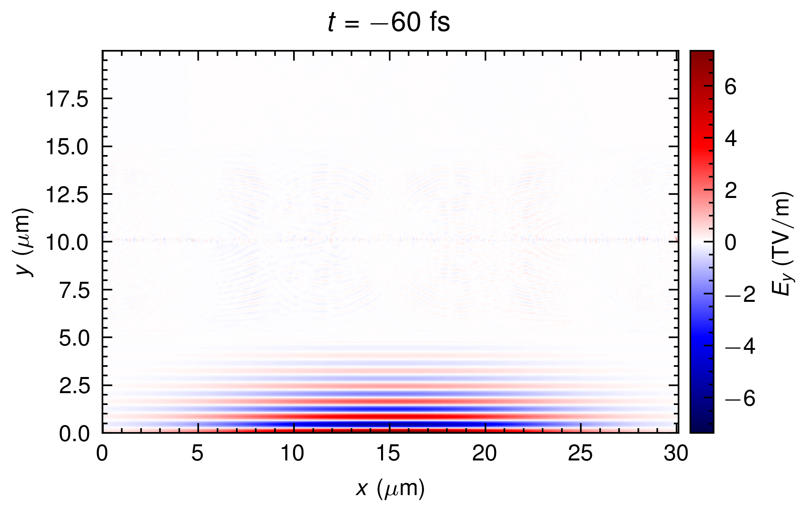

Conversion from FLASH to openPMD
================================

FLASH => openPMD (ELI-NP, Romania)

## QuickStart
To begin, the following dependencies are required:

#### Dependencies:

- numpy, scipy, yt
- openPMD-api

#### Running the conversion:

See `Convert.ipynb` for the flow of conversion

The converted file will be located in the output folder with the extension `.h5`

Simulation output from FLASH code.

The openPMD output after 6 times refinement in both X and Y directions.

PIConGPU simulation by using the profile converted from FLASH. The figure shows the electron density profile duing the interaction with the rising edge of the laser main pulse.
 
