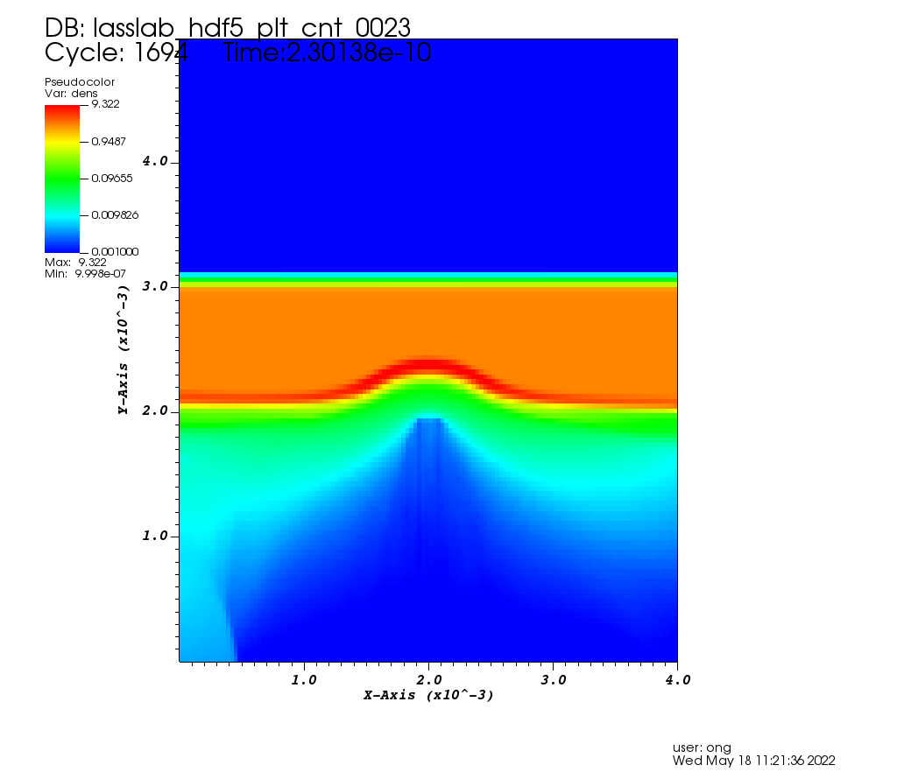

Conversion from FLASH to openPMD
================================

FLASH => openPMD (ELI-NP, Romania)

## QuickStart
To begin, the following dependencies are required:

#### Dependencies:

- numpy, scipy, yt
- openPMD-api

#### Running the conversion:

- open terminal and go to `/scr`

- type `chmod +x f2opmd.sh`

- make sure the data file you want to convert is in the Data folder 

- then run the converter with `./f2opmd`

- enter the file name, e.g. `lassab_hdf5_plt_cnt_0100`

- enter the refinement level for each axis

- enter the output filename, e.g. `gas_0`

- your converted file will be in the output folder with the extension `.h5`

