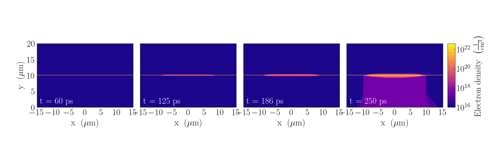
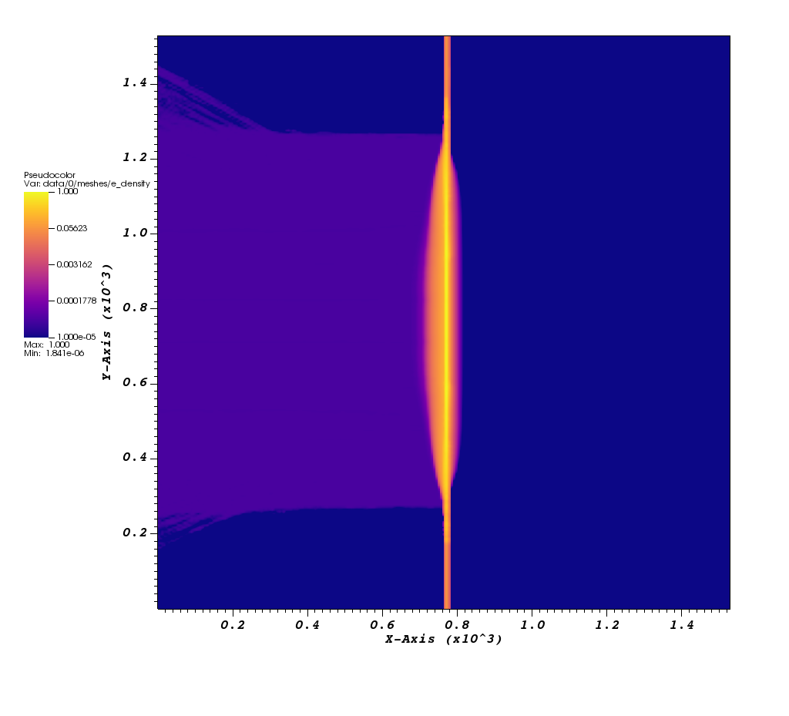
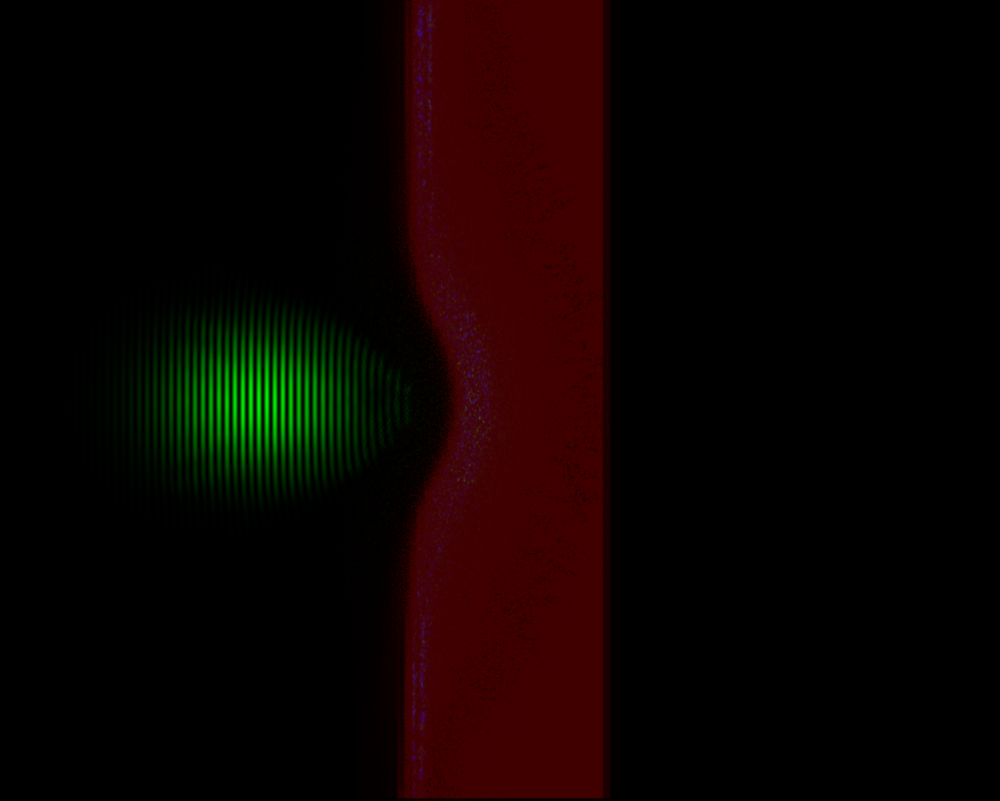

Conversion from FLASH to openPMD
================================

FLASH => openPMD (ELI-NP, Romania)

## QuickStart
To begin, the following dependencies are required:

#### Dependencies:

- numpy, scipy, yt
- openPMD-api

#### Running the conversion:

- In the terminal, change directory to `/src`

- Type `chmod +x f2opmd.sh` to add the permission for execution

- Run the conversion with `./f2opmd.sh`
  
- Enter the simulation directory which contains your output file with the name `**_hdf5_plt_cnt_**`

- Enter the file iteration, e.g. `100`

- Enter the refinement level for each axis

- Enter the output filename, e.g. `gas_0`

- The converted file will be located in the output folder with the extension `.h5`

Simulation output from FLASH code.

The openPMD output after 6 times refinement in both X and Y directions.

PIConGPU simulation by using the profile converted profile from FLASH.

