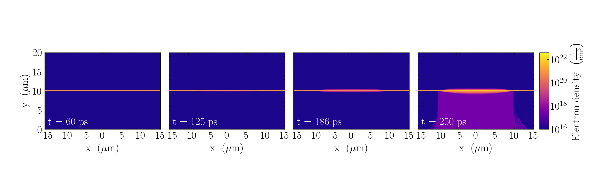
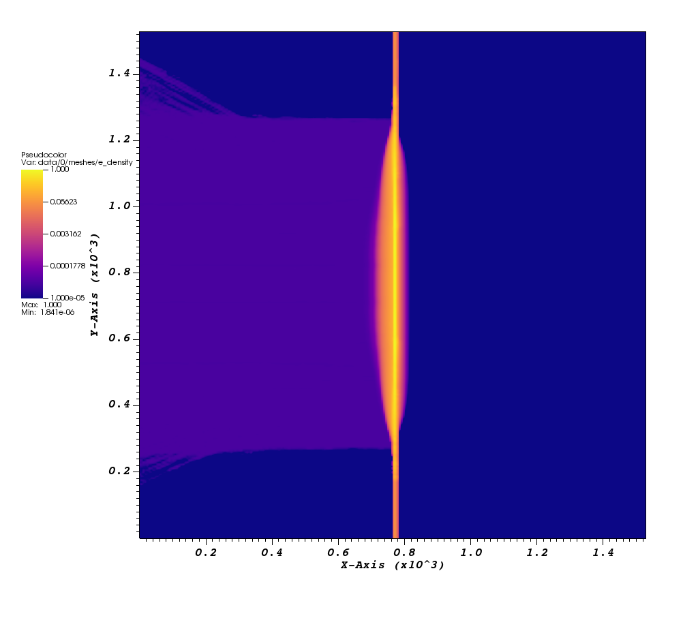
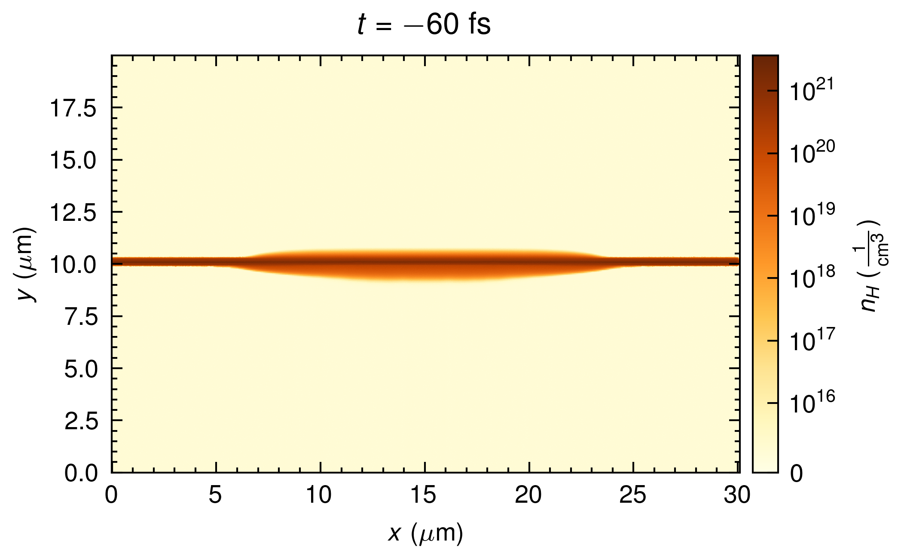
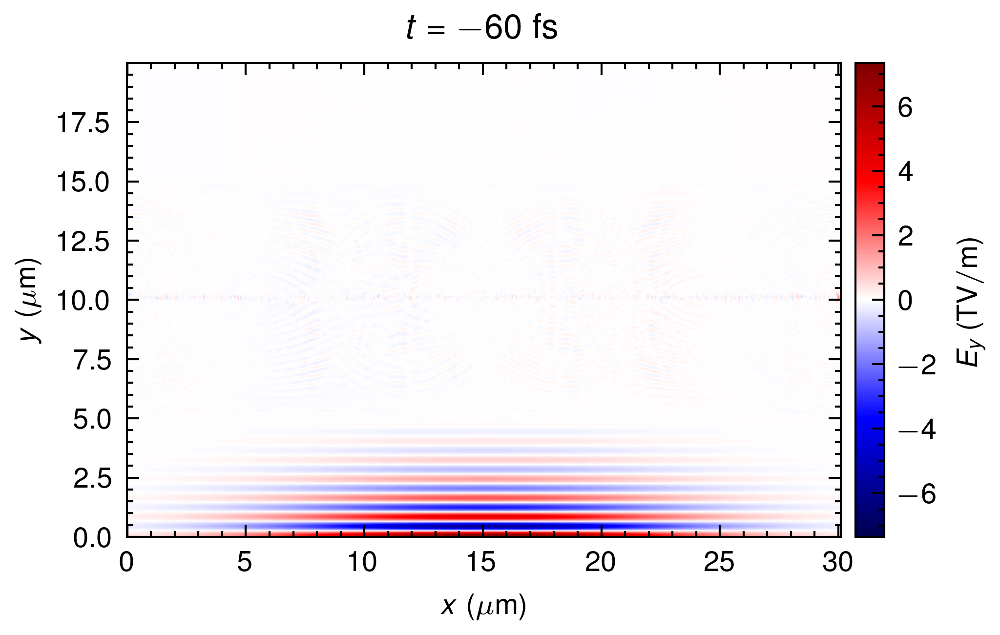
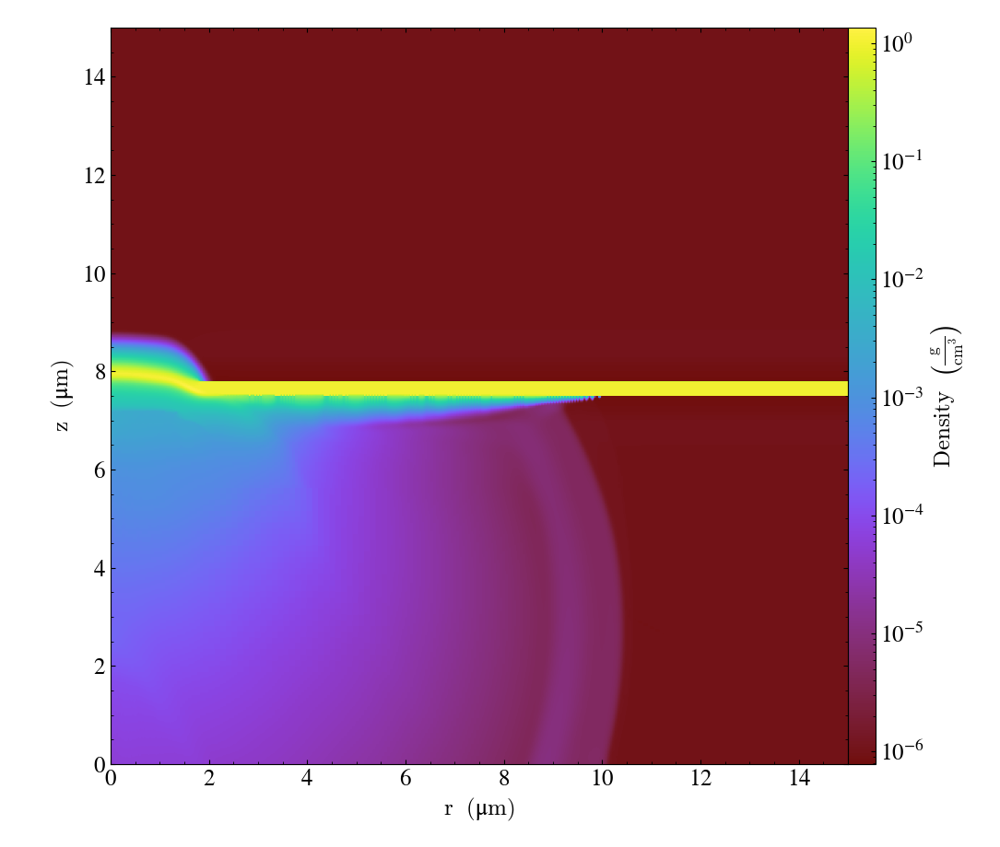
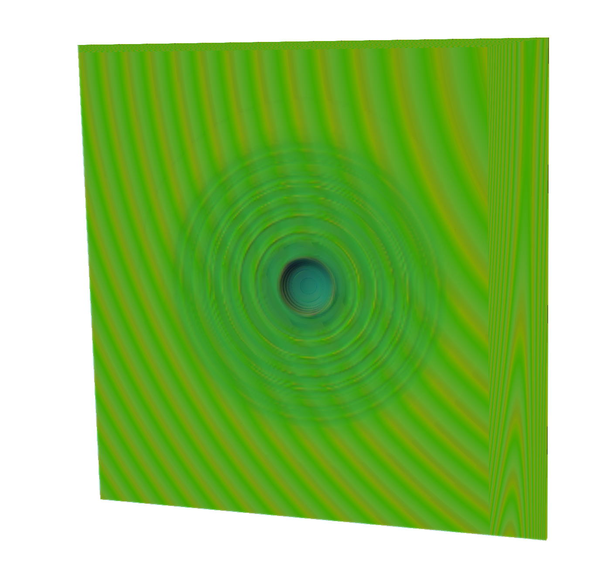
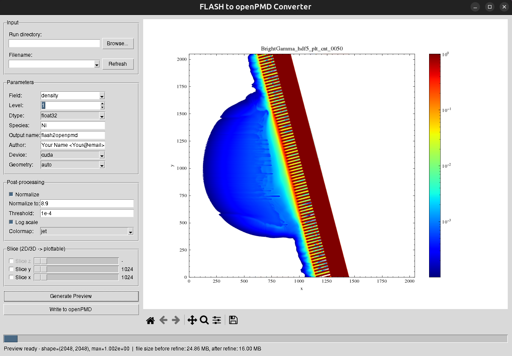
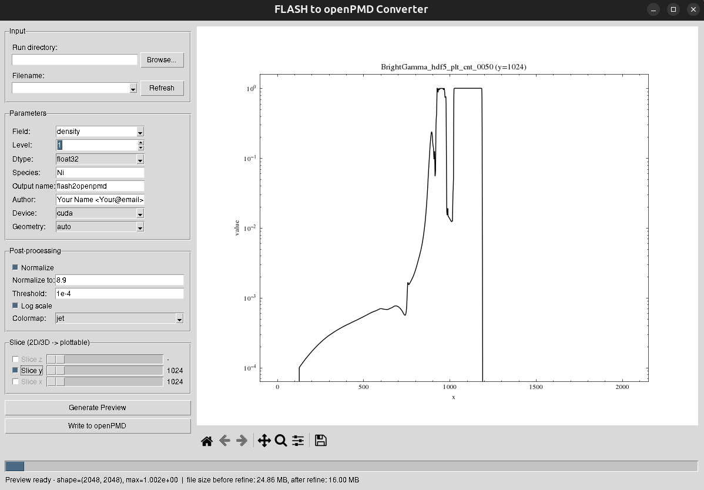

Conversion from FLASH to openPMD
================================

[](https://doi.org/10.5281/zenodo.23261567)

FLASH => openPMD (ELI-NP, Romania)

## QuickStart

#### Layout:

- `src/` - core scripts: `flash2openpmd.py` (library + CLI), `gui.py`, `launch.py`
- `src/output/` - example output images and a sample converted openPMD file
- `lib/python/` - shared plotting code (`plotting.py`)
- `misc/` - `environment.yml` conda environment spec
- `Data/` - sample FLASH input

#### Dependencies:

`misc/environment.yml` defines the `flash2openpmd` conda environment
(numpy, scipy, matplotlib, yt, openpmd-api, and pytorch for optional GPU
acceleration). Create it with:

```
conda env create -f misc/environment.yml
```

or just run `python src/launch.py`, which checks for the environment and
offers to create it for you (and self-heals the HDF5/h5py version-mismatch
issue that can occur between yt's conda hdf5 build and the pip-installed
openpmd-api wheel).

#### Running the conversion:

Two ways to run a conversion:

- **CLI**: `python src/flash2openpmd.py <run_directory> <filename> [options]`.
  Shows a preview plot before writing by default; pass `-y`/`--yes` to skip
  the confirmation prompt, `--no-preview` to skip the plot, and
  `--device cuda` to accelerate the cylindrical-geometry rotation on GPU
  (falls back to CPU automatically if CUDA isn't usable). Run with `--help`
  for the full option list.
- **GUI**: `python src/launch.py` (or `python src/gui.py` if the environment
  is already active) opens a window to pick the run directory/file, set
  parameters, preview the plot, and only write to openPMD after confirming.

The converted file has the extension `.h5` with custom name

Simulation output from FLASH code.



The openPMD output after 6 level refinement in both X and Y directions.




PIConGPU simulation by using the profile converted from FLASH. The figure shows the electron density profile duing the interaction with the rising edge of the laser main pulse.

 

#### Cylindrical geometry:

The output from cylindrical geometry simulation is rotated by 360 degree around its axis of symmetry to obtain 3D Cartesian geometry array.

 

#### GUI:

The GUI lets you pick the run directory/file, set conversion parameters, preview the plot, and only writes to openPMD after confirming.

 



## Citation

If you use Flash2OpenPMD in your work, please cite it. Citation metadata is in
[`CITATION.cff`](CITATION.cff) (GitHub shows a "Cite this repository" button
for it), and each GitHub release is archived on Zenodo with a DOI.
To cite all versions, use DOI
[10.5281/zenodo.23261567](https://doi.org/10.5281/zenodo.23261567).
